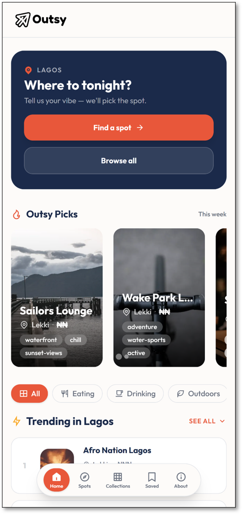

# Outsy


> Open the app, pick a spot, go out — in under 60 seconds.

## About The Project

Outsy was built to eliminate the decision fatigue that comes with planning outings. Instead of scrolling across Instagram, TikTok, Google Maps, and WhatsApp for hours, users can open Outsy and instantly receive clear, curated outing ideas with the vibe, price, and location already sorted. 

This project represents my commitment to expanding my skillset while delivering a robust, production-ready solution. I chose a bleeding-edge stack (Next.js 15+ App Router, Tailwind CSS v4) to challenge myself with the latest web standards, focusing heavily on responsive, mobile-first design, performance optimization, and scalable component architecture.

## Screenshots

<details>
  <summary>Click to view screenshots</summary>

  <br />

  | Home & Discovery | Spot Details | Collections |
  |:---:|:---:|:---:|
  |  |  |  |
  |  |  |  |

</details>

## Key Features

- **Instant Curation:** Hand-picked, categorized spots (restaurants, hotels, activities, hidden gems) tailored for individuals, couples, or groups.
- **The "Golden Sequence":** Optimized user flow designed to get users from opening the app to making a decision in under 3 clicks.
- **Progressive Disclosure:** Smart UI that prevents decision fatigue by showing only top results first, using intuitive carousels and clean filters.
- **Offline-First Saves:** Leverages browser `localStorage` to let users build and save their custom itineraries without needing an account.
- **Zero-Friction Sharing:** Integrated with Resend to email saved lists directly to friends or groups without a backend server.

## Tech Stack

- **Framework:** Next.js 15+ (App Router)
- **Styling:** Tailwind CSS v4, `shadcn/ui`
- **Database:** Supabase (Mocked via local JSON files for MVP)
- **Icons & UI:** `react-icons` (Remix/Lucide), `@splidejs/react-splide` (Carousels)
- **Hooks:** `reacthaiku`
- **Analytics:** PostHog
- **Hosting:** Vercel

## Architecture & Implementation Details

To ensure Outsy remains highly performant and scalable, I tackled several complex engineering problems:

1. **Adopting Bleeding-Edge Standards (Tailwind v4 & Next.js 15):** 
   Configured the project to utilize Tailwind CSS v4's new CSS-only configuration (`@theme`), migrating away from `tailwind.config.js`. Paired with Next.js 15's default Server Components, this significantly reduced the client-side bundle size, pushing heavy rendering and data-fetching tasks to the server.
   
2. **Schema-Driven Mock Data Strategy:**
   Before wiring up Supabase, I built a local JSON database structure (`/data/*.json`) that perfectly mirrors the planned relational Supabase schema. By abstracting the data access layer into server-side helpers (`/lib/data.ts`), I ensured that transitioning from local flat-files to a live Postgres database will require zero changes to the UI components.

3. **Strict Mobile-First, Capability-Based Design:**
   Implemented a rigorous mobile-first layout strategy enforcing Hick's Law and the 3-Click Rule. To solve the common "sticky hover" issue on mobile touchscreens, I utilized capability-based media queries (`@media (hover: hover)`) rather than arbitrary screen-size breakpoints, ensuring a seamless, native-app-like experience across all devices.

## Getting Started

Follow these instructions to set up the project locally.

### Prerequisites

- Node.js (v18.17.0 or higher)
- npm or pnpm

### Installation

1. Clone the repository
   ```bash
   git clone https://github.com/your-username/outsy.git
   ```

2. Navigate to the project directory
   ```bash
   cd outsy
   ```

3. Install NPM packages
   ```bash
   npm install
   ```

4. Create an `.env.local` file in the root directory:
   ```env
   NEXT_PUBLIC_POSTHOG_KEY=your_posthog_key
   NEXT_PUBLIC_POSTHOG_HOST=https://app.posthog.com
   RESEND_API_KEY=your_resend_api_key
   ```

5. Run the development server
   ```bash
   npm run dev
   ```

6. Open [http://localhost:3000](http://localhost:3000) in your browser to view the app.

### Database Setup (Future)

Currently, the app relies on mock JSON files in `/data`. Once Supabase is connected:

1. Link your Supabase project:
   ```bash
   npx supabase link --project-ref your-project-id
   ```
2. Push the schema to the remote database:
   ```bash
   npx supabase db push
   ```
